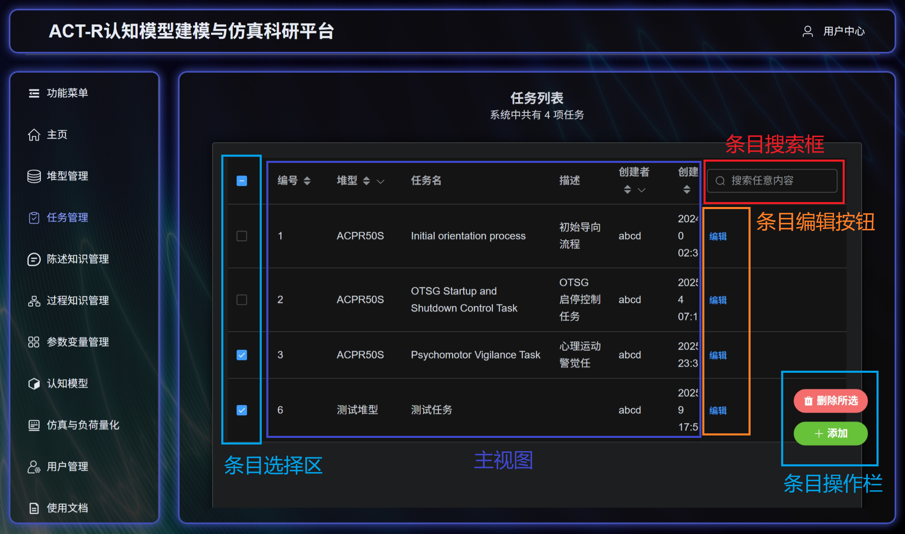
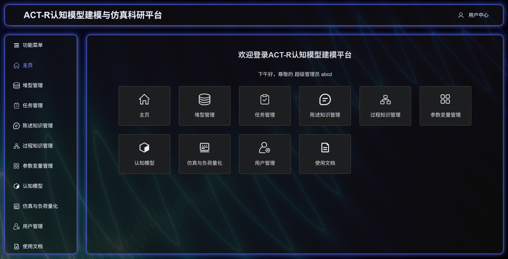
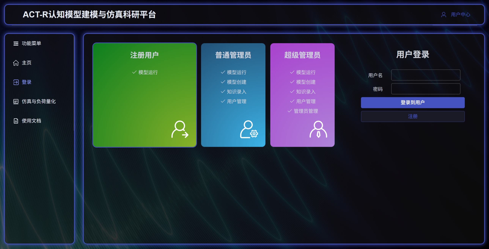
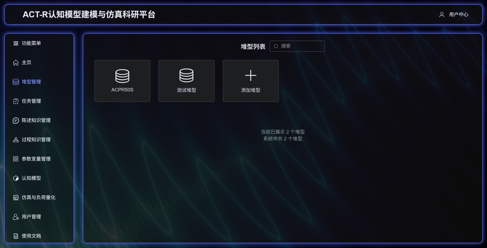
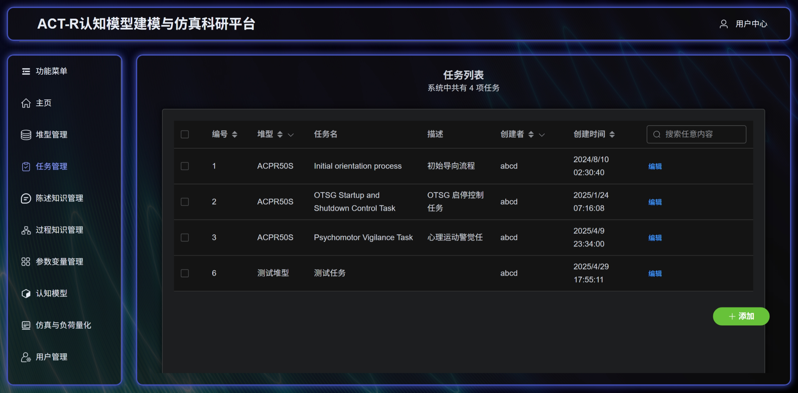
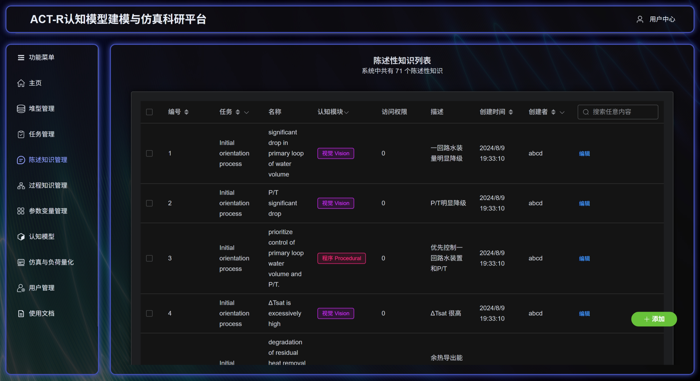
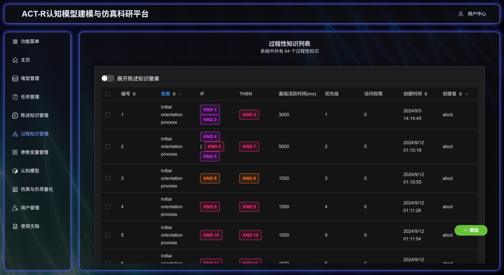
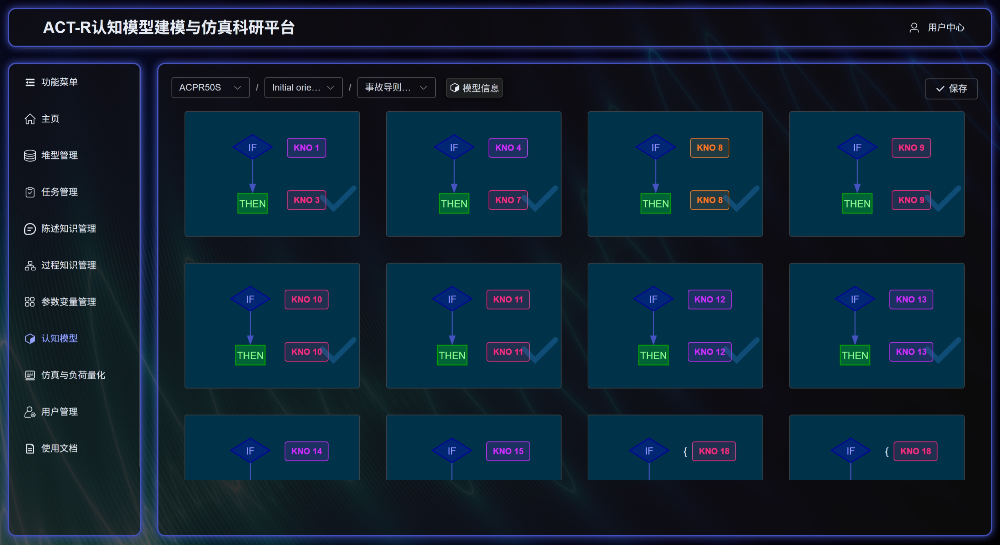

> 《认知模型建模平台使用文档》 \
> 文档版本号：V1.0 \
> 适用软件版本号： V1.0 \
> 修订日期：2025年5月

# 认知模型建模平台使用文档

## 用户类型与功能访问

本系统采用四级用户权限管理体系，通过分层授权机制实现功能隔离与数据安全管控：

| 等级 | 用户类型  | 描述                                     | 身份验证 |
|----|-------|----------------------------------------|------|
| 0  | 游客    | 匿名未登录访问系统的用户类型                         | 无    |
| 1  | 注册用户  | 在平台完成注册的一般访客                           | 有    |
| 2  | 管理员   | 具有数据管理性质的用户，平台后台直接创建或由超级管理员在注册用户的基础上升级 | 有    |
| 3  | 超级管理员 | 平台初始化创建的根用户，仅一位                        | 有    |

## 系统功能模块描述

系统采用模块化架构设计，各功能模块权限控制如下：

| 平台模块名称  | 类型     | 访问权限    |
|---------|--------|---------|
| 主页      | 功能目录预览 | 游客及以上   |
| 登录/注册   | 身份验证   | 游客      |
| 堆型管理    | 数据条目管理 | 管理员及以上  |
| 任务管理    | 数据条目管理 | 管理员及以上  |
| 陈述知识管理  | 数据条目管理 | 管理员及以上  |
| 过程知识管理  | 数据条目管理 | 管理员及以上  |
| 参数变量管理  | 数据条目管理 | 管理员及以上  |
| 认知模型    | 数据条目管理 | 管理员及以上  |
| 仿真与负荷量化 | 功能性模块  | 注册用户及以上 |
| 用户管理    | 数据条目管理 | 超级管理员   |

### 数据列表操作与显示图例



### 主页

主页模块是用户进入平台后的首要界面，旨在为用户提供清晰友好的导航体验。当用户登录后，系统会根据当前时间动态展示问候语（如“上午好”“下午好”），并显示用户的身份角色（如管理员、员工）及用户名，未登录用户则会看到引导登录的提示信息。页面中央以整齐排列的功能卡片形式展示各项核心操作入口（如场景管理、模型设计等），用户点击卡片即可快速跳转至对应功能页面。所有功能卡片的展示内容均根据用户角色权限自动调整，确保不同层级的使用者只能访问授权范围内的功能模块，有效保障系统安全性。页面布局采用自适应设计，无论是电脑、平板还是手机，都能自动适配屏幕尺寸，保持操作便捷性。当平台后续新增功能时，无需修改主页结构即可自动生成新的导航入口，显著提升了系统的扩展性和维护效率。整个模块通过直观的视觉设计和智能化的权限管理，为用户打造高效、安全的工作起点。



### 登录/注册

登录与注册界面是用户进入ACT-R认知模型建模平台的首要入口，采用直观的双栏布局设计，左侧展示不同角色权限的功能说明，右侧提供用户登录和注册操作区域。在登录界面，用户可以通过点击左侧三种不同角色选项（普通用户、普通管理员和超级管理员）来了解各角色对应的系统权限范围，每种角色都配有专属的视觉标识和详细的功能清单。右侧登录区域要求用户输入用户名和密码，系统会根据所选角色类型显示对应的登录按钮提示，同时提供注册功能入口。注册界面延续了相同的布局风格，左侧角色选择区域保持不变，右侧则切换为注册表单，要求用户填写用户名、密码和邮箱等基本信息，并自动根据所选角色类型完成账户注册。整个界面采用响应式设计，确保在不同设备上都能保持良好的视觉效果和操作体验，通过清晰的视觉层次和即时的操作反馈，帮助用户快速完成身份验证或账户创建流程。



### 堆型管理

堆型管理模块为用户提供了完整的堆型数据维护功能，采用卡片式布局直观展示所有堆型信息。页面顶部设有搜索框，支持通过ID、名称、描述或创建者等字段快速筛选堆型。每个堆型以独立卡片形式呈现，卡片上显示堆型名称和图标，点击卡片可查看详细属性（包括ID、创建者、描述和创建时间）。系统根据用户权限动态显示操作按钮，创建者可对所属堆型进行编辑或删除操作，具有该模块权限的用户可在列表末尾通过“添加堆型”按钮创建新堆型。

添加堆型功能通过弹出对话框实现，要求用户填写堆型名称和描述信息，系统会自动校验名称唯一性，提供“保存并继续”和“保存”两种提交方式。编辑功能采用侧边抽屉面板形式，允许创建者修改堆型的基本信息。删除操作设有二次确认机制，避免误操作导致数据丢失。页面底部实时显示当前筛选结果数量及系统堆型总数，方便用户掌握数据规模。整个模块采用响应式设计，确保在不同设备上都能获得良好的操作体验，通过清晰的视觉反馈和流畅的交互流程，帮助用户高效完成堆型数据管理工作。



### 任务管理

**ACT-R平台任务管理模块功能说明**

任务管理模块为用户提供了完整的任务创建、查询和维护功能。系统采用表格形式展示所有任务信息，顶部显示任务总数，并配有全局搜索框，支持通过任务编号、名称、描述、堆型名称或创建者等任意字段进行快速筛选。表格支持多选操作，用户可对任务数据进行排序和按堆型或创建者进行筛选。

任务创建功能通过弹出对话框实现，要求用户填写任务名称、选择关联堆型并添加描述信息，系统会自动校验任务名称唯一性，提供"
保存并继续"和"保存"两种提交方式。编辑功能采用侧边抽屉面板形式，允许创建者修改任务的基本信息和关联堆型，同时提供删除功能。系统还支持批量删除操作，用户可选中多个任务后一键删除，操作结果会实时反馈成功和失败数量。

页面右下角固定显示操作按钮区，包含"添加任务"和"删除所选"
两个主要功能按钮，确保用户在任何位置都能快速执行操作。整个模块采用响应式设计，加载过程中显示进度提示，确保在不同设备上都能获得良好的操作体验。通过清晰的表格布局和直观的操作流程，帮助用户高效完成任务管理工作。



### 陈述性知识管理

陈述性知识管理模块为用户提供了完整的知识创建、查询和维护功能。系统采用表格形式展示所有知识条目，顶部显示知识总数，并配有全局搜索框，支持通过知识编号、名称、描述、关联任务或认知模块等任意字段进行快速筛选。表格支持多选操作，用户可对知识数据进行排序和按任务或创建者进行筛选。

知识创建功能通过弹出对话框实现，要求用户填写知识名称、选择关联任务和认知模块类型并添加描述信息，系统会自动校验必填字段，提供"
保存并继续"和"保存"两种提交方式。编辑功能采用侧边抽屉面板形式，允许创建者修改知识的基本信息和关联任务，同时提供删除功能。系统还支持批量删除操作，用户可选中多个知识条目后一键删除，操作结果会实时反馈成功和失败数量。

认知模块类型采用彩色标签直观区分，便于用户快速识别。页面右下角固定显示操作按钮区，包含"添加知识"和"删除所选"
两个主要功能按钮，确保用户在任何位置都能快速执行操作。整个模块采用响应式设计，加载过程中显示进度提示，确保在不同设备上都能获得良好的操作体验。通过清晰的表格布局和直观的操作流程，帮助用户高效完成知识管理工作。



### 过程性知识管理

过程性知识管理模块采用"IF-THEN"
规则形式，为用户提供认知行为规则的创建和管理功能。系统以表格形式展示所有过程性知识规则，顶部显示规则总数，并支持按任务、创建者等条件筛选。每条规则清晰展示条件(
IF)和结果(THEN)两部分，用户可通过开关控制是否展开详细陈述性知识标签。

规则创建采用向导式流程：首先选择关联任务，然后分别设置条件部分和结果部分，各自由陈述性知识构成，并可添加NOT逻辑前缀。用户还可设置规则的活跃时间和执行优先级。系统提供"
保存并继续"和"保存"两种提交方式，便于批量创建规则。

页面支持多选操作，可批量删除规则，右下角固定显示"添加规则"和"删除所选"
功能按钮。模块采用响应式设计，加载时显示进度提示，确保各类设备上的操作体验。通过这种结构化的规则管理方式，帮助研究人员有效构建和调整认知行为模型。



### 参数变量管理视图

认知模型构建模块采用层级式工作流设计，引导用户逐步完成从堆型定义到认知规则建立的完整建模过程。系统顶部提供面包屑导航栏，依次选择堆型、任务和认知模型三个层级，每个层级都支持即时创建新条目。当选定认知模型后，界面右侧显示"
保存"按钮，左侧展示模型基本信息卡片。

核心工作区采用可视化卡片布局展示所有过程性知识规则（IF-THEN形式），选中认知模型后可通过点击卡片将其加入当前模型（选中状态显示蓝色标记）。底部提供"
添加知识"
入口，支持创建新的认知规则。知识创建采用向导式流程：首先选择或新建条件部分（IF）的陈述性知识，然后设置结果部分（THEN）的陈述性知识，最后配置规则的活跃时间和优先级。系统特别提供"
添加反面知识"功能，可快速创建逻辑取反的规则变体。

模块包含完整的辅助功能：

1. **状态管理**：定义模型初始参数
2. **知识库管理**：整合了上述陈述性知识和过程性知识的添加功能，维护基础认知元素
3. **模型信息管理**：编辑模型选中的知识元素，元数据和权限设置

所有操作均实时反馈，支持多级撤销。界面采用响应式设计，确保研究人员在不同设备上都能流畅完成复杂的认知建模工作。通过这种结构化的交互方式，能够显著降低构建ACT-R认知模型的技术门槛。



## 接口开放

### 基础信息

- 基础 URL: `/api/`
- 认证方式: Token 认证 (需要在请求头中添加 `Authorization: Token <your_token>`)
- 数据格式: JSON

### 用户管理接口

#### 1. 用户注册

- **URL**: `/api/user/register/`
- **方法**: POST
- **请求参数**:
  ```json
  {
    "username": "string",
    "password": "string",
    "email": "string",
    "role": "integer"
  }
  ```
- **响应**:
    - 成功: 201 Created
    - 失败: 400 Bad Request

#### 2. 用户登录

- **URL**: `/api/user/login/`
- **方法**: POST
- **请求参数**:
  ```json
  {
    "username": "string",
    "password": "string"
  }
  ```
- **响应**:
    - 成功: 200 OK (返回 token)
    - 失败: 401 Unauthorized

#### 3. 用户登出

- **URL**: `/api/user/logout/`
- **方法**: POST
- **权限**: 需要认证
- **响应**: 200 OK

#### 4. 获取当前用户信息

- **URL**: `/api/user/me/`
- **方法**: GET
- **权限**: 需要认证
- **响应**: 200 OK (返回用户信息)

#### 5. 获取所有用户列表

- **URL**: `/api/user/users/`
- **方法**: GET
- **权限**: 需要管理员权限
- **响应**: 200 OK (返回用户列表)

### 认知建模接口

#### 1. 堆型管理

- **列表/创建**: `/api/coper/reactormodel/`
    - GET: 获取所有堆型
    - POST: 创建新堆型
- **详情/更新/删除**: `/api/coper/reactormodel/<int:pk>/`
    - GET: 获取详情
    - PUT: 更新堆型
    - DELETE: 删除堆型

#### 2. 任务管理

- **列表/创建**: `/api/coper/task/`
    - GET: 获取所有任务
    - POST: 创建新任务
- **详情/更新/删除**: `/api/coper/task/<int:pk>/`
    - GET: 获取详情
    - PUT: 更新任务
    - DELETE: 删除任务

#### 3. 初始状态管理

- **列表/创建**: `/api/coper/initstatus/`
    - GET: 获取所有初始状态
    - POST: 创建新初始状态
- **详情/更新/删除**: `/api/coper/initstatus/<int:pk>/`
    - GET: 获取详情
    - PUT: 更新初始状态
    - DELETE: 删除初始状态

#### 4. 状态变量管理

- **列表/创建**: `/api/coper/statusvar/`
    - GET: 获取所有状态变量
    - POST: 创建新状态变量
- **详情/更新/删除**: `/api/coper/statusvar/<int:pk>/`
    - GET: 获取详情
    - PUT: 更新状态变量
    - DELETE: 删除状态变量

#### 5. 陈述性知识管理

- **列表/创建**: `/api/coper/dk/`
    - GET: 获取所有陈述性知识
    - POST: 创建新陈述性知识
- **详情/更新/删除**: `/api/coper/dk/<int:pk>/`
    - GET: 获取详情
    - PUT: 更新陈述性知识
    - DELETE: 删除陈述性知识

#### 6. 过程性条件管理

- **列表/创建**: `/api/coper/pcon/`
    - GET: 获取所有过程性条件
    - POST: 创建新过程性条件
- **详情/更新/删除**: `/api/coper/pcon/<int:pk>/`
    - GET: 获取详情
    - PUT: 更新过程性条件
    - DELETE: 删除过程性条件

#### 7. 过程性结果管理

- **列表/创建**: `/api/coper/pout/`
    - GET: 获取所有过程性结果
    - POST: 创建新过程性结果
- **详情/更新/删除**: `/api/coper/pout/<int:pk>/`
    - GET: 获取详情
    - PUT: 更新过程性结果
    - DELETE: 删除过程性结果

#### 8. 过程性知识管理

- **列表/创建**: `/api/coper/pknow/`
    - GET: 获取所有过程性知识
    - POST: 创建新过程性知识
- **详情/更新/删除**: `/api/coper/pknow/<int:pk>/`
    - GET: 获取详情
    - PUT: 更新过程性知识
    - DELETE: 删除过程性知识

#### 9. 认知模型管理

- **列表/创建**: `/api/coper/cm/`
    - GET: 获取所有认知模型
    - POST: 创建新认知模型
- **详情/更新/删除**: `/api/coper/cm/<int:pk>/`
    - GET: 获取详情
    - PUT: 更新认知模型
    - DELETE: 删除认知模型
- **获取模型详情**: `/api/coper/model/<int:pk>/`
    - GET: 获取模型完整详情

### 数据模型说明

#### 1. 用户模型

```json
{
  "id": "integer",
  "username": "string",
  "email": "string",
  "role": "integer"
}
```

#### 2. 堆型模型

```json
{
  "id": "integer",
  "title": "string",
  "description": "string",
  "creator": "User",
  "created_at": "datetime"
}
```

#### 3. 任务模型

```json
{
  "id": "integer",
  "title": "string",
  "description": "string",
  "reactormodel": "ReactorModel",
  "creator": "User",
  "created_at": "datetime"
}
```

#### 4. 陈述性知识模型

```json
{
  "id": "integer",
  "title": "string",
  "description": "string",
  "trunktype": "string",
  "task": "Task",
  "creator": "User",
  "created_at": "datetime"
}
```

#### 5. 认知模型

```json
{
  "id": "integer",
  "name": "string",
  "author": "string",
  "task": "Task",
  "description": "string",
  "initstatus": [
    "InitStatus"
  ],
  "statusvariable": [
    "StatusVariable"
  ],
  "production": [
    "PKnowledge"
  ],
  "creator": "User",
  "created_at": "datetime"
}
```

### 错误响应

所有错误响应都遵循以下格式:

```json
{
  "error": "string",
  "message": "string"
}
```

常见错误码:

- 400: 请求参数错误
- 401: 未授权
- 403: 禁止访问
- 404: 资源不存在
- 500: 服务器内部错误